# School_District_Analysis

# Overview
This code was done following a previous analysis of reports of grades for various subjects amongst different school districts. The original report monitored how schools were performing based upon pass rates for the various subjects broken up amongst grade level, passing rate for the exams, school spending per student as well as school type.

Following the intial report it was determined that, based upon the information contained within said report, academic dishonesty had taken place amongst the ninth grades students for Thomas High School in the subjects of reading and math. It was determined that these scores had been altered. Therefore, it was decided that these scores had to be removed from the overall reports so as to not scew the final reporting.

# Results
* Following the removal of the ninth grade reading and math scores for Thomas High School we can see how it affected the data. Below is the original district summary:

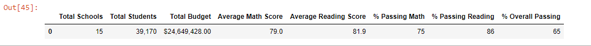

and here is the district summary following the removal of the scores:

While ultimately the difference for the district as a whole is not the large, the only noticeable difference being the drop from average math scores from 79 to 78.9 and a corresponding drop in passing math percentage from 75 to 74%, as we drill down further in the data the impact of the removal will become more pronounced.

* Listed here is the original data for the school summary:

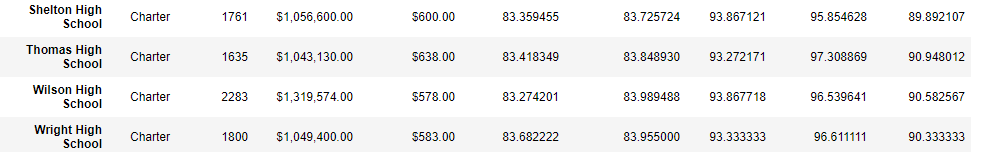

and here is the revised data following the cleanse:

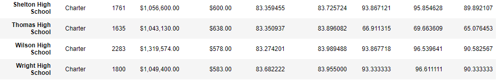

We can see here that the changes are more pronounced with average math scores dropping from 83.41 to to 83.35 and a nearly 30% drop in the number of students passing math and reading.

* It is notable to check how the removal of these scores might affect Thomas' High Schools performance compared to the other schools on the list. In the original data base Thomas High School was listed as one of the top five performing schools in the county by pass rate.

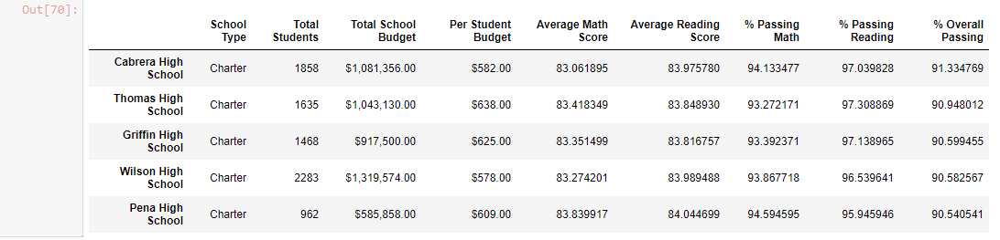

Whereas after removing the fixed scores Thomas High School in no longer amongst the top five

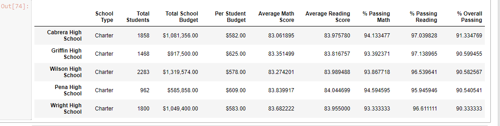

* When we check the ninth grade reading and math scores for students in Thomas High before the removal we can see the following data:

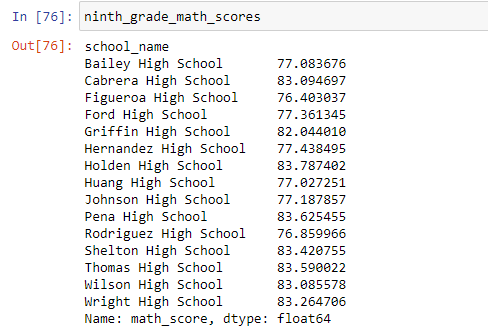

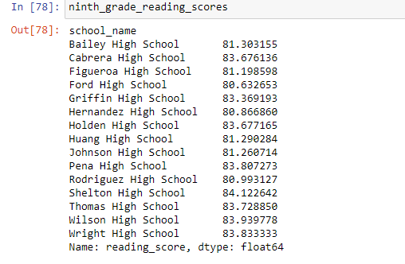

However following the removal we have the following, due to all the scores being removed in favor of a null value:

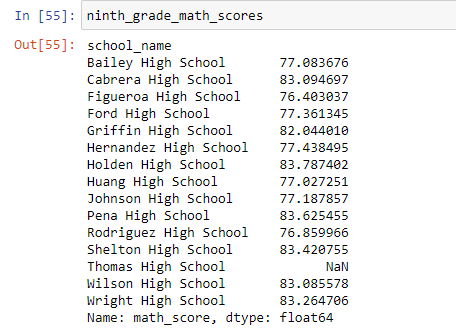

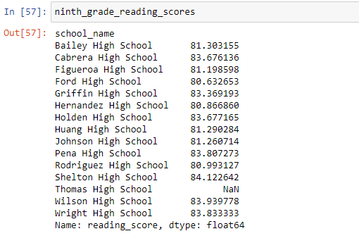

* Additionally when we look at how it changed the data for performance based upon school size we can see the original data:

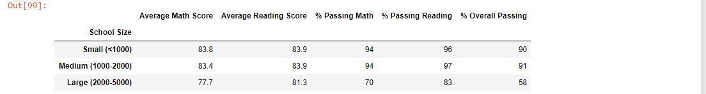

versus the changed data

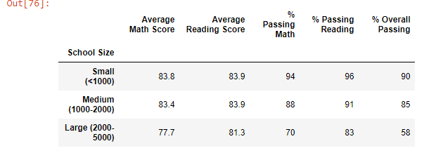

We can see how the path rate has decreased dramatically for reading and math scores in the Medium Sized school bucket.

* Finally changes have also come about when we analyze the data based upon school type. Refer to the original data below:

versus the changed data

We can see how the overall pass rate as well as the pass rate for reading and math has dropped.

